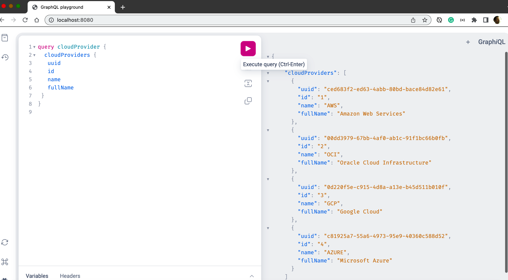

# 🧃 Vending Machine POC — Go + GraphQL 

A proof-of-concept (POC) microservice that models a vending machine backend using **Golang**, **GraphQL**, and **PostgreSQL**. This application is cloud-ready and includes modules to simulate multi-cloud scenarios (AWS, OCI).

---

## 🚀 Overview

This project allows users to query and mutate vending machine inventory and simulate user interactions via a GraphQL API. It's useful as a base for learning GraphQL server-side development in Go, infrastructure integration (OCI/AWS), and database schema management.

---

## 🧱 Tech Stack

- **GoLang** – Backend language
- **GraphQL** – API query language (via gqlgen)
- **PostgreSQL** – Relational database
- **Docker** – Containerized deployment
- **Fly.io** – (Optional) For deployment
- **AWS / OCI modules** – For cloud resource emulation

---

## 📁 Folder Structure

```
vending-machine-golang-graphql/
├── awscompose/              # AWS simulation logic
├── base/                    # DB helper and init logic
├── ocicompose/              # OCI simulation logic
├── graph/
│   ├── schema.graphqls      # GraphQL schema
│   ├── resolver.go          # Root resolver
│   └── model/               # Auto-generated models
├── documentation/           # Setup guides & images
├── Dockerfile               # Docker build script
├── server.go                # Main Go entrypoint
└── docker-compose.yml       # Orchestration
```

---

## 🛠 Setup Guide

### 📦 Dependencies

- Go 1.18+
- PostgreSQL
- gqlgen (`go install github.com/99designs/gqlgen@latest`)

### 🧪 Local Dev Setup

```bash
git clone https://github.com/your-org/vending-machine-golang-graphql.git
cd vending-machine-golang-graphql
go run ./server.go
```

Open your browser at: [http://localhost:8080](http://localhost:8080)  
GraphQL Playground will be available.



---

## ⚙️ Presetup (Cloud + DB)

- 📘 [Cloud Setup](./documentation/CLOUD-SETUP.md)
- 🗃️ [DB Setup](./documentation/DB-SETUP.md)

---

## 💻 Sample Queries

### Query Example

```graphql
query {
  items {
    id
    name
    price
  }
}
```

### Mutation Example

```graphql
mutation {
  addItem(input: {
    name: "Coca-Cola",
    price: 1.5
  }) {
    id
    name
  }
}
```

More examples in:
- `sample-scripts-query.gql`
- `sample-scripts-mutations.gql`

---


## ✍️ Author

Built with Simplificare
